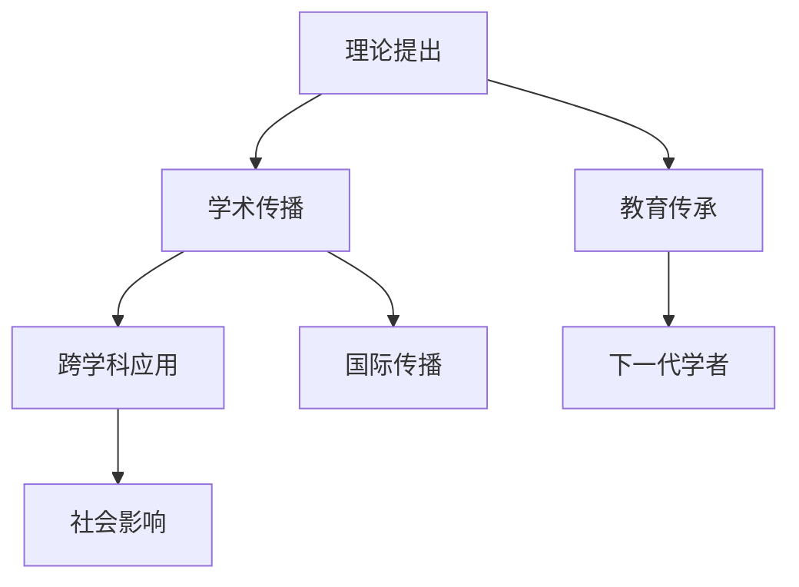

<!--
专家思想地图分析报告模板 v2.1
优化版本：支持语义化变量、模块化设计、量化质量控制
template_name: expert_analysis_report_v2
version: 2.1
required_data: [expert_name, publication_data, citation_network]
optional_data: [social_impact, interdisciplinary_work, controversies]
output_formats: [markdown, html, pdf]
-->

# {{expert_name}} 专家思想地图分析报告

## 🎯 核心发现概览

### 基本信息
- **专家姓名**: {{expert_name:text}}
- **研究领域**: {{field_of_expertise:text}}
- **分析时间**: {{analysis_date:date}}
- **分析置信度**: {{confidence_score:number}}/100
- **数据质量评分**: {{data_quality_score:number}}/100

### 主要学术贡献（3-5项）
{{#main_contributions}}
- **{{contribution_year:date}}**: {{contribution_title:text}} - {{contribution_impact:text}}
{{/main_contributions}}

### 影响力评估
| 维度 | 评级 | 说明 |
|------|------|------|
| **学术影响力** | {{academic_impact_level:enum:高/中/低}} | {{academic_impact_desc:text}} |
| **跨学科影响** | {{interdisciplinary_impact:enum:强/中/弱}} | {{interdisciplinary_impact_desc:text}} |
| **理论原创性** | {{originality_score:number}}/10 | {{originality_desc:text}} |

### 关键转折点
{{#turning_points}}
- **{{turning_point_year:date}}**: {{turning_point_description:text}}
{{/turning_points}}

---

## 📊 执行摘要

{{executive_summary:text:500}}

---

## 🔍 数据质量与透明度

### 文献统计概览
- **总文献数**: {{total_publications:number}} 篇 (要求: ≥30篇) {{#publication_check}}✅{{/publication_check}}{{^publication_check}}❌{{/publication_check}}
- **时间跨度**: {{analysis_timespan_years}} 年 (要求: ≥10年) {{#timespan_check}}✅{{/timespan_check}}{{^timespan_check}}❌{{/timespan_check}}
- **核心期刊占比**: {{core_journal_percentage:number}}% (要求: ≥40%) {{#core_journal_check}}✅{{/core_journal_check}}{{^core_journal_check}}❌{{/core_journal_check}}
- **平均相关性评分**: {{avg_relevance_score:number}} (要求: ≥0.6) {{#relevance_check}}✅{{/relevance_check}}{{^relevance_check}}❌{{/relevance_check}}

### 数据来源
{{#data_sources}}
- **{{source_name:text}}**: {{source_count:number}} 篇文献
{{/data_sources}}

### 分析局限性
{{analysis_limitations:text}}

---

## 📈 六维度深度分析

### 1. ⏰ 时间维度分析

#### 学术生涯阶段
{{#career_stages}}
- **{{stage_name:text}}** ({{start_year:date}}-{{end_year:date}}): {{stage_description:text}}
{{/career_stages}}

#### 理论演化轨迹
```mermaid
timeline
    title {{expert_name}} 理论发展时间线
{{#theory_evolution}}
    section {{period_name}}
        {{key_event_year:date}}: {{event_description:text}}
{{/theory_evolution}}
```

#### 影响力扩散模式
{{influence_spread_analysis:text}}

### 2. 🌍 背景维度分析

#### 学术谱系定位
- **博士导师**: {{doctoral_advisor:text}} ({{advisor_institution:text}})
- **学术传统**: {{academic_tradition:text}}
- **所属学派**: {{academic_school:text}}

#### 历史科学环境
{{historical_context_analysis:text}}

#### 同时代学者对比
{{#contemporary_comparison}}
- **{{contemporary_name:text}}**: {{comparison_description:text}}
{{/contemporary_comparison}}

### 3. 🕸️ 网络维度分析

#### 合作者关系网络
```mermaid
graph LR
{{#collaboration_network}}
    A[{{expert_name}}] --> B[{{collaborator_name:text}}]
    B --> C[{{collaborator_institution:text}}]
{{/collaboration_network}}
```

#### 引用网络分析
- **总被引次数**: {{total_citations:number}}
- **H指数**: {{h_index:number}}
- **高频合作者**: {{frequent_collaborators:number}} 人
- **国际合作比例**: {{international_collaboration_rate:number}}%

#### 知识传播路径
{{knowledge_diffusion_analysis:text}}

### 4. 🔍 批判维度分析

#### 理论优势
{{theoretical_strengths:text}}

#### 局限性与边界条件
{{limitations_and_boundaries:text}}

{{#has_controversial_findings}}
#### 学术争议与批评
{{#controversies}}
- **争议点**: {{controversy_topic:text}}
- **主要批评者**: {{critic_name:text}}
- **专家回应**: {{expert_response:text}}
{{/controversies}}
{{/has_controversial_findings}}

#### 潜在偏见识别
{{potential_biases:text}}

### 5. 🛠️ 方法论维度分析

#### 研究设计哲学
{{research_design_philosophy:text}}

#### 主要研究方法
{{#research_methods}}
- **{{method_name:text}}**: {{method_description:text}}
{{/research_methods}}

#### 证据评估标准
{{evaluation_standards:text}}

#### 跨学科方法整合
{{#interdisciplinary_integration}}
- **整合学科**: {{integrated_field:text}}
- **整合方式**: {{integration_approach:text}}
{{/interdisciplinary_integration}}

### 6. 📊 影响力维度分析

#### 学术影响力指标
| 指标 | 数值 | 解释 |
|------|------|------|
| **高被引论文** | {{highly_cited_papers:number}} 篇 | ≥100次引用 |
| **期刊影响因子** | {{avg_journal_impact:number}} | 平均IF |
| **国际合作** | {{international_collaborations:number}} 篇 | 跨国合作 |
| **学术传承** | {{academic_descendants:number}} 人 | 博士学生等 |

#### 社会影响力
{{#has_social_impact}}
#### 社会影响分析
{{social_impact_analysis:text}}
- **公众影响力**: {{public_impact:enum:高/中/低}}
- **政策影响**: {{policy_impact:enum:强/中/弱}}
- **教育影响**: {{educational_impact:enum:显著/一般/有限}}
{{/has_social_impact}}

---

## 🎨 可视化图表

### 图2：理论概念演化图
```mermaid
graph TD
{{#concept_evolution}}
    A[{{initial_concept:text}}] --> B[{{development_stage_1:text}}]
    B --> C[{{development_stage_2:text}}]
    C --> D[{{current_form:text}}]
    A --> E[{{criticism:text}}]
    E --> B
    E --> C
    D --> F[{{future_direction:text}}]
{{/concept_evolution}}
```

### 图3：影响力传播路径


---

## 🔍 质量控制检查清单

### 数据质量验证
- [ ] 文献总数 ≥ 30篇：{{total_publications:number}} 篇 {{#publication_check}}✅{{/publication_check}}{{^publication_check}}❌{{/publication_check}}
- [ ] 核心期刊占比 ≥ 40%：{{core_journal_percentage:number}}% {{#core_journal_check}}✅{{/core_journal_check}}{{^core_journal_check}}❌{{/core_journal_check}}
- [ ] 相关性评分 ≥ 0.6：{{avg_relevance_score:number}} {{#relevance_check}}✅{{/relevance_check}}{{^relevance_check}}❌{{/relevance_check}}
- [ ] 时间跨度 ≥ 10年：{{analysis_timespan_years}} 年 {{#timespan_check}}✅{{/timespan_check}}{{^timespan_check}}❌{{/timespan_check}}

### 分析完整性验证
- [ ] 六维度均有具体发现：{{completed_dimensions}}/6 {{#dimensions_complete}}✅{{/dimensions_complete}}{{^dimensions_complete}}❌{{/dimensions_complete}}
- [ ] 包含批判性观点：{{has_criticism:boolean}} {{#has_criticism}}✅{{/has_criticism}}{{^has_criticism}}❌{{/has_criticism}}
- [ ] 识别理论边界：{{has_boundaries:boolean}} {{#has_boundaries}}✅{{/has_boundaries}}{{^has_boundaries}}❌{{/has_boundaries}}
- [ ] 提供可视化支持：{{visualization_count:number}} 个 {{#has_visualizations}}✅{{/has_visualizations}}{{^has_visualizations}}❌{{/has_visualizations}}

### 结论可信度验证
- [ ] 证据充分性：{{evidence_strength:enum:强/中/弱}} {{#evidence_strong}}✅{{/evidence_strong}}{{^evidence_strong}}❌{{/evidence_strong}}
- [ ] 逻辑一致性检查：{{logic_consistency:enum:通过/待改进}} {{#logic_consistent}}✅{{/logic_consistent}}{{^logic_consistent}}❌{{/logic_consistent}}
- [ ] 多源验证：{{source_diversity:enum:高/中/低}} {{#high_diversity}}✅{{/high_diversity}}{{^high_diversity}}❌{{/high_diversity}}

### 总体质量评估
**综合得分**: {{overall_quality_score:number}}/100
**质量等级**: {{quality_grade:enum:优秀/良好/一般/需改进}}

---

## 📋 条件章节（按需显示）

{{#is_established_expert}}
## 学术传承与影响

### 博士学生网络
{{#doctoral_students}}
- **{{student_name:text}}** ({{graduation_year:date}}): {{student_current_position:text}}
{{/doctoral_students}}

### 学术后代
{{academic_descendants_analysis:text}}
{{/is_established_expert}}

{{#is_early_career_expert}}
## 发展潜力评估

### 研究轨迹预测
{{career_trajectory_prediction:text}}

### 合作机会分析
{{collaboration_opportunities:text}}
{{/is_early_career_expert}}

{{#has_interdisciplinary_work}}
## 跨学科影响分析

{{#interdisciplinary_impacts}}
- **学科领域**: {{field:text}}
- **影响程度**: {{impact_level:enum:强/中/弱}}
- **具体贡献**: {{contribution:text}}
{{/interdisciplinary_impacts}}
{{/has_interdisciplinary_work}}

---

## 📝 结论与建议

### 主要结论
{{main_conclusions:text}}

### 学术定位
{{academic_positioning:text}}

### 理论价值评估
{{theoretical_value_assessment:text}}

### 发展前景
{{future_prospects:text}}

### 研究建议
{{research_recommendations:text}}

---

## 🔧 实用工具和资源

### 文献管理
- **完整文献列表**: [下载CSV]({{literature_csv_link:default:"#"}})
- **引用网络数据**: [下载JSON]({{network_json_link:default:"#"}})
- **时间序列数据**: [下载Excel]({{timeline_excel_link:default:"#"}})

### 可视化资源
- **高分辨率图表**: [下载PDF]({{charts_pdf_link:default:"#"}})
- **交互式网络图**: [在线查看]({{interactive_network_link:default:"#"}})
- **时间线动画**: [在线播放]({{timeline_animation_link:default:"#"}})

### 后续研究建议
1. **推荐延伸阅读**:
{{#recommended_reading}}
   - {{reading_title:text}} ({{reading_author:text}}, {{reading_year:date}})
{{/recommended_reading}}

2. **相关专家分析**:
{{#related_experts}}
   - {{expert_name:text}} - {{expert_field:text}}
{{/related_experts}}

3. **潜在合作机会**:
{{#collaboration_opportunities}}
   - {{opportunity_description:text}}
{{/collaboration_opportunities}}

---

## 📚 完整参考文献

### 引用规范说明
本报告采用Nature期刊参考文献格式，所有文献均包含PubMed链接以确保可验证性。

### 参考文献

{{REFERENCES}}

#### 引用统计
- **文献总数**: {{TOTAL_REFERENCES:number}} 篇
- **期刊文章**: {{JOURNAL_ARTICLES:number}} 篇
- **高被引论文**: {{HIGHLY_CITED:number}} 篇 (≥100次引用)
- **最新研究**: {{RECENT_STUDIES:number}} 篇 (2020年后发表)

#### Nature参考文献格式示例
```
[1] Dawkins, R. The Selfish Gene (Oxford University Press, 1976).
[2] Hamilton, W.D. The genetical evolution of social behaviour. J. Theor. Biol. 7, 1–16 (1964). https://pubmed.ncbi.nlm.nih.gov/14115693/
[3] Wilson, E.O. & Wilson, D.S. Rethinking the theoretical foundation of sociobiology. Q. Rev. Biol. 82, 327–348 (2007). https://pubmed.ncbi.nlm.nih.gov/18008823/
```

---

## 📊 附录

### A. 高被引论文列表
{{#highly_cited_papers_list}}
- **{{paper_title:text}}** ({{journal_name:text}}, {{publication_year:date}}) - {{citation_count:number}} 次引用
{{/highly_cited_papers_list}}

### B. 重要时间节点
{{#important_timeline_events}}
- **{{event_year:date}}**: {{event_description:text}}
{{/important_timeline_events}}

### C. 主要合作者
{{#key_collaborators_list}}
- **{{collaborator_name:text}}** ({{collaborator_institution:text}}) - {{collaboration_count:number}} 篇合作论文
{{/key_collaborators_list}}

{{#has_controversial_findings}}
### D. 批评文献汇总
{{#criticism_literature}}
- **{{criticism_title:text}}** - {{criticism_author:text}} ({{criticism_year:date}})
{{/criticism_literature}}
{{/has_controversial_findings}}

### E. 相关资源链接
{{#related_resources_links}}
- [{{resource_name:text}}]({{resource_url:text}})
{{/related_resources_links}}

---

**报告生成时间**: {{report_generation_time:default:当前时间}}
**分析师**: Claude Expert Analysis System
**版本**: v2.1 - Enhanced Depth Analysis Framework

*本报告基于公开可获得的学术数据和信息，旨在提供客观、深度的专家分析。如有疑问或需要补充信息，请参考原始数据源。*