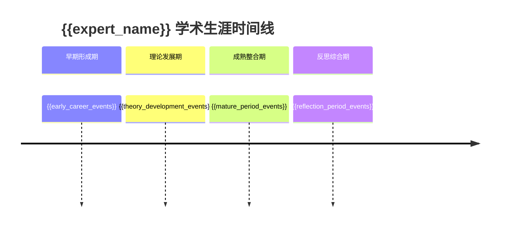
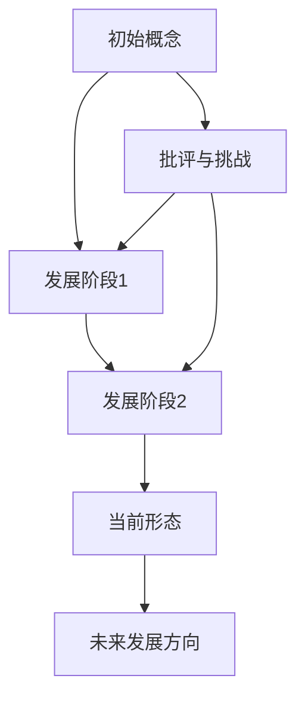
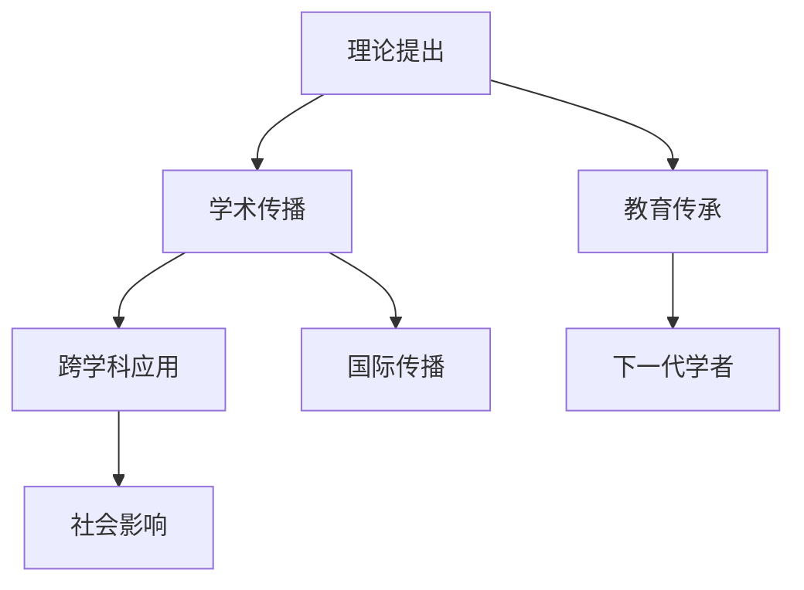

# 专家思想地图分析报告

## 📊 报告概要

**分析对象**：{{expert_name}}  
**研究领域**：{{field_of_expertise}}  
**分析时间**：{{analysis_date}}  
**分析置信度**：{{confidence_score}}  
**数据质量评分**：{{data_quality_score}}

### 执行摘要
{{executive_summary}}

---

## 🎯 核心发现

### 主要学术贡献
{{main_contributions}}

### 理论创新点
{{theoretical_innovations}}

### 学术影响力评估
{{academic_impact_summary}}

---

## 📈 六维度深度分析

### 1. ⏰ 时间维度分析

#### 学术生涯阶段
{{career_stages_analysis}}

#### 关键转折点
{{turning_points_analysis}}

#### 理论演化轨迹
{{theory_evolution_analysis}}

#### 影响力扩散模式
{{influence_spread_analysis}}

### 2. 🌍 背景维度分析

#### 历史科学环境
{{historical_context_analysis}}

#### 学术谱系定位
{{academic_lineage_analysis}}

#### 同时代学者对比
{{contemporary_comparison_analysis}}

#### 社会经济背景
{{socioeconomic_context_analysis}}

#### 文化认知框架
{{cognitive_framework_analysis}}

#### 地理空间因素
{{geographical_factors_analysis}}

### 3. 🕸️ 网络维度分析

#### 合作者关系网络
{{collaboration_network_analysis}}

#### 引用网络分析
{{citation_network_analysis}}

#### 知识传播路径
{{knowledge_diffusion_analysis}}

#### 学术生态定位
{{academic_ecosystem_position}}

### 4. 🔍 批判维度分析

#### 理论优势分析
{{theoretical_strengths}}

#### 局限性与边界条件
{{limitations_and_boundaries}}

#### 主要批评与回应
{{criticism_and_responses}}

#### 潜在偏见识别
{{potential_biases}}

#### 替代解释考量
{{alternative_explanations}}

### 5. 🛠️ 方法论维度分析

#### 研究设计哲学
{{research_design_philosophy}}

#### 证据评估标准
{{evaluation_standards}}

#### 模型构建思维
{{model_construction_thinking}}

#### 验证策略偏好
{{validation_strategies}}

#### 跨学科方法整合
{{interdisciplinary_integration}}

### 6. 📊 影响力维度分析

#### 学术影响力指标
{{academic_impact_metrics}}

#### 思想影响力评估
{{intellectual_impact_assessment}}

#### 社会影响力分析
{{social_impact_analysis}}

#### 跨学科影响
{{cross_disciplinary_impact}}

#### 长期vs短期影响
{{temporal_impact_analysis}}

---

## 🎨 可视化图表

### 图1：学术生涯时间线


### 图2：理论概念演化图


### 图3：学术合作网络
```mermaid
graph LR
    A[{{expert_name}}] --> B[核心合作者1]
    A --> C[核心合作者2]
    A --> D[核心合作者3]
    B --> E[二级网络]
    C --> F[二级网络]
    D --> G[二级网络]
```

### 图4：影响力传播路径


---

## 📋 数据来源与质量

### 主要数据源
{{data_sources_list}}

### 文献统计
- **总文献数**：{{total_publications}}
- **时间跨度**：{{time_span_years}} 年
- **高被引论文**：{{highly_cited_papers}} 篇
- **合作论文**：{{collaborative_papers}} 篇

### 数据质量评估
{{data_quality_assessment}}

---

## 🔍 分析方法说明

### 分析框架
{{analysis_framework_description}}

### 工具使用
{{tools_used_description}}

### 质量控制措施
{{quality_control_measures}}

---

## ⚠️ 分析局限性与不确定性

### 数据局限性
{{data_limitations}}

### 分析局限性
{{analysis_limitations}}

### 置信度评估
{{confidence_assessment}}

---

## 📝 结论与建议

### 主要结论
{{main_conclusions}}

### 学术定位
{{academic_positioning}}

### 理论价值评估
{{theoretical_value_assessment}}

### 发展前景
{{future_prospects}}

### 研究建议
{{research_recommendations}}

---

## 📚 附录

### A. 高被引论文列表
{{highly_cited_papers_list}}

### B. 重要时间节点
{{important_timeline_events}}

### C. 主要合作者
{{key_collaborators_list}}

### D. 批评文献汇总
{{criticism_literature_summary}}

### E. 相关资源链接
{{related_resources_links}}

---

## 📊 报告质量检查清单

- [ ] 数据来源权威可靠
- [ ] 分析过程逻辑一致
- [ ] 结论有充分证据支撑
- [ ] 考虑了多元观点和批评
- [ ] 识别了分析局限性
- [ ] 符合学术伦理标准
- [ ] 格式规范、结构清晰

---

**报告生成时间**：{{report_generation_time}}  
**分析师**：Claude Expert Analysis System  
**版本**：v2.0 - Enhanced Depth Analysis Framework

*本报告基于公开可获得的学术数据和信息，旨在提供客观、深度的专家分析。如有疑问或需要补充信息，请参考原始数据来源。*